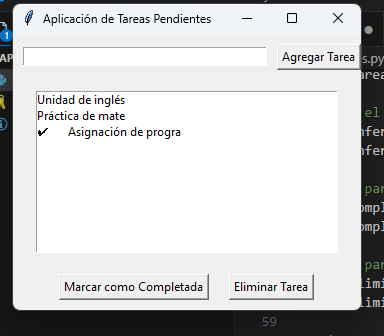

# Aplicación de tareas
>Interfaz para organizar tareas pendientes

## Descripción
Esta aplicación permite a los usuarios agregar, eliminar y marcar tareas como completadas mediante una interfaz gráfica desarrollada con la librería `Tkinter` de Python.

## Modo de uso
1. **Ubicación del directorio**  
   Navega al directorio del proyecto:
   ```bash
   cd RepoApp/AppTareas

2. **Comando**
    ```bash
    python AplicacionTareas.py

3. **Imagen de ejemplo**

    
